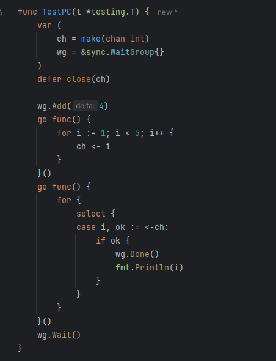

# ch
    make(chan int) // 无缓存区
    向无缓存区的chan中添加数据会报错（如果有存在 <- 预行就不会）

    make(chan int,3) // 有缓存区
    写缓存区chan中添加数据不会报错 （超过也会报错）
# close ch
    向已经关闭的chan中添加数据会报错
    读取已经关闭的chan中数据会返回默认值 （有值的话会继续读值）

# 默认值问题
    chani <- 0
    close(chani)
    val, ok := <-chani
	val2, ok2 := <-chani
	fmt.Println(val, ok)
	fmt.Println(val2, ok2)
    // 0,true 
    // 0,false
    
    // 0值是不是我塞进去的
    
    
    

