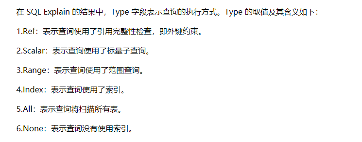

# map
    不安全
    
    map 是一种hash table
    实现原理

    动态数组（Bucket Array）：
        Go 的 map 使用一个称为“桶（bucket）”的动态数组来存储键值对。每个桶可以存储多个键值对。    

    1、哈希函数：当向 map 中插入键值对时，Go 使用一个哈希函数将键转换为索引。
        哈希函数将键映射到一组固定范围内的整数值，这些整数值用来确定键值对在内部数组中的存储位置。

    2、桶（bucket）和链表：map 的底层数据结构是一个桶的数组，每个桶包含一个链表或一个二叉树。
        当多个键通过哈希函数计算得到相同的索引时，它们会被存储在同一个桶中。如果链表长度较短，Go 会使用链表来存储键值对；
        如果链表长度较长，Go 会将链表转换为平衡二叉树来提高性能。

    3、碰撞解决：由于不同的键可能会产生相同的哈希值，也就是发生了碰撞。
        为了解决碰撞问题，Go 使用链表或平衡二叉树来存储具有相同索引的键值对。
        在进行查找、插入或删除操作时，会根据键的哈希值和比较函数来遍历链表或平衡二叉树。

    4、动态扩容：在插入键值对时，如果哈希表的负载因子 -6.5（load factor）超过阈值，就会触发动态扩容。
        扩容过程中，Go 会创建一个更大的桶数组，并将现有的键值对重新分配到新的桶中。
        这样可以减少碰撞，并且保持查找的性能。

    1.等量扩容
    时机：溢出桶过多：由于map中不断的put和delete key，桶中可能会出现很多断断续续的空位，这些空位会导致连接的bmap溢出桶很长，导致扫描时间边长。
    操作：申请和原来等量的内容，将原来的数据重新整理后，写入到新的内存中。可以简单的认为是一次内存整理，目的是提高查询效率。
    引申，如果没有等量扩容会出现什么问题？随着溢出桶缓慢增长，有内存溢出的风险。

    2.增量扩容
    时机：装载因子(键值对/桶)>6.5
    操作：增量扩容 分成两步： 第一步进入扩容状态，先申请一块新的内存，翻倍增加桶的数量，此时buckets指向新分配的桶，oldbuckets指向原来的桶。 第二步，重新计算老的桶中的哈希值在新的桶内的位置（取模或者位操作），将旧数据用渐进式的方式拷贝到新的桶中。
    渐进 式迁移分两块，一方面会从第一个桶开始，顺序迁移每一个桶，如果下一个桶已经迁移，则跳过。另一方面，当我们操作某一个桶的元素时，会迁移两个桶，进而保证经过一些操作后一定能够完成迁移。
    当我们访问一个正在迁移的Map时，如果存在oldbuckets，那么直接去中oldbuckets寻找数据。当我们遍历一个正在迁移的Map时，新的和旧的就会遍历，如果一个旧的的桶已经迁移走了，那么就直接跳过，反正不在旧的就在新的里。Map遍历本身就是无序的。

# sync.map
    安全
    sync.map 通过读写分离和写加锁等机制实现了并发读写的功能。
    但是只适合读多写少的情况，若出现写多/并发多的场景， 会导致 read map 缓存失效，需要加锁，冲突变多，性能急剧下降。这是他的重大缺点。

    sync.Map 的底层实现是一个 dirty 的 hashmap，它分为两部分：一部分是在没有写操作的情况下是一个全局可见的 read map，
    另一部分是在有写操作时，才会被初始化的 dirty map。

    sync.Map底层使用了两个原生map，一个叫read，仅用于读；一个叫dirty，用于在特定情况下存储最新写入的key-value数据：

    另外有 misses 字段来统计 read 被穿透的次数（被穿透指需要读 dirty 的情况），
    超过一定次数则将 dirty 数据更新到 read 中（触发条件：misses=len(dirty)）

    新增的数据进入dirty里面 ，并且吧只读map的amend设置为true表示此时两个map不相等

    func (m *Map) missLocked() {
         m.misses++
    if m.misses < len(m.dirty) {
        return
    }
    m.read.Store(&readOnly{m: m.dirty})
    m.dirty = nil
    m.misses = 0
    }
    // 这里赋值给readOnly相当于一个增量更新 

    更新操作
    如果read中有则原子swap
    如果read中没有也是读到值去swap
    都没有的时候则是新增操作--此时read的amended变成了true表示read和dirty已经不一致了
    然后就回到上面的代码